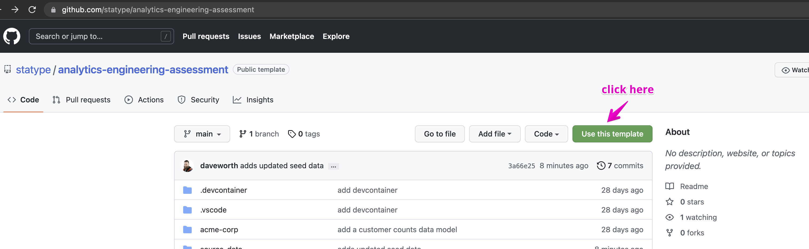
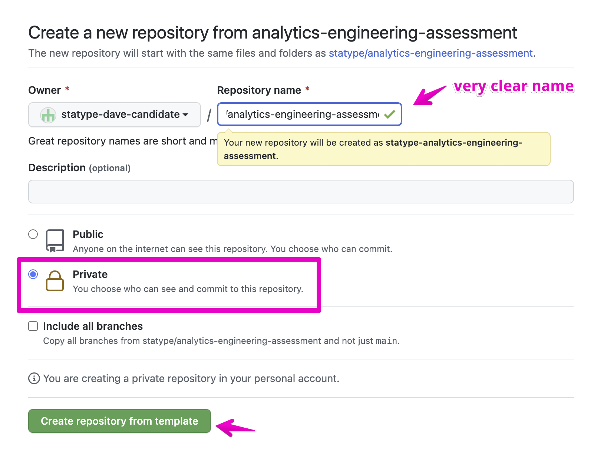
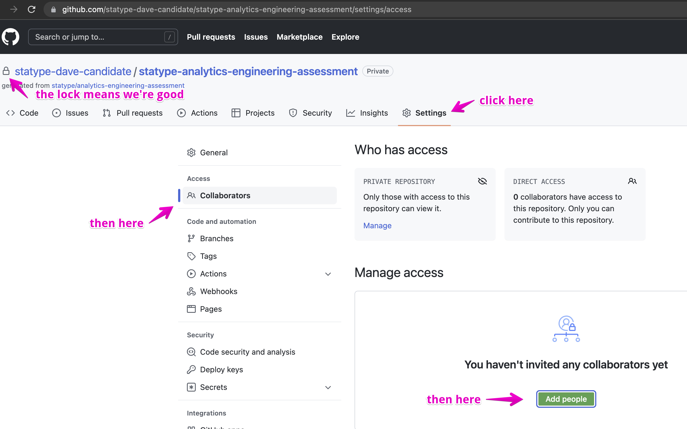

# Data Analytics Technical Assessment

This repository contains a skeleton [`dbt`](https://getdbt.com) project to which
we would like you, a Data Analytics Candidate, to make some improvements.  The
goal of this assessment is not to produce a perfect or polished result but to
show what you can do and figure out in a short time table so that we might
iterate on it together in the next stage.

If you are unfamiliar with `dbt` you should still be able to complete the
assignment, albeit with a bit more research and reading of documentation.
That's great!  Keep notes and we can talk about your research later.  In the
mean time competency in SQL and the examples in the `models/` directory should
allow you to make progress even without `dbt` experience.

## Getting Started

### Get the assignment

1. This repository is a template repository. Please use the *`Use this template`*
to create a new *Private* repository in your personal GitHub account:

2. On the next screen please select these options:

3. Add your Statype contact as an external contributor - they should have
  provided their Github Username but if they forgot please just ask:

### Setting up your computer

#### With a devcontainer

_Prerequisites_:
* Ensure you have [VSCode](https://code.visualstudio.com/download) installed locally.
* Ensure you have [Docker](https://docs.docker.com/get-docker/) installed locally.

When you open this repository in VSCode you should be prompted to re-open the
project in a container.  Once the container is running Postgres will be running
in a container, python will be installed, and `dbt` and `sqlfluff` (a configured
SQL linter) will be ready to roll.

if you want to use the configured devcontainer but do not use VSCode there are
other ways to use devcontainers as documented on the internet or you can follow
the "Without a devcontainer" directions below.

#### Without a devcontainer

_Prerequisites_:
* Ensure you have Docker and docker-compose running locally.
* Ensure you have Python and pip installed for local use.  You may
  optionally use a pipenv or virtualenv or other isolation mechanism for Python
  of your choosing.

Within the `.devcontainer/` directory there is a `docker-compose.yml` and a
`setup.sh` script.  The compose should be operatable as is via `docker-compose
run -f .devcontainer/docker-compose.yml`.

Install the Python dependencies via `pip install -r requirements.txt` - this
installs `dbt` and its Postgres driver and a SQL linter that is `dbt` aware.

Install dbt dependencies - from within `acme-corp/` run `dbt deps`.

## The Assignment

Please take 2-3h to complete the following tasks. 3 hours is an absolute
maximum.  We would rather an unpolished working solution after 2 hours than an
incredibly polished and "perfect" solution after 10.)

The model defined in `marts/customers/customer_counts_daily.sql` counts the
total number of customer records created over time as a metric (timeseries).
This _may_ be a vanity metric a company might track e.g. "We have had N
customers signup since we launched!"  This does *not* calculate the more
meaningful metric of "how many active customers do we have on day Y?" which is
good for tracking engagement and for reasoning about revenue.

We would like you to build two models: Active Customers by Day and Churn by Day
as both a raw number of churned customers and a percentage of active customers
on that day.  On your way to so doing please feel free to refactor or change our
staging or models in marts.

### Additional smaller tasks

During your work you may notice that there is little in the way of testing or
documentation captured in this project.  These are not a replacement for solving
the core assignments of finding Active Customers by Day and Churn by Day but
should you find that you have some remaining time or that addressing the below
help you acheive the main goals we encourage you to do one or more of the
following (or others we have not addressed - simply describe them in detail in
your solution).

- [ ] Add [Documentation](https://docs.getdbt.com/docs/building-a-dbt-project/documentation) to Sources and/or
      Models or more sophisticated documentation with ["doc blocks"](https://docs.getdbt.com/docs/building-a-dbt-project/documentation#using-docs-blocks)
- [ ] Add [Generic Tests](https://docs.getdbt.com/docs/building-a-dbt-project/tests#generic-tests) to our models.
- [ ] Add one or more [Singular Tests](https://docs.getdbt.com/docs/building-a-dbt-project/tests#singular-tests)
      to one or more of our models.

### Submitting the Assignment

Please feel comfortable working on the `main` branch in this repository.  You
may absolutely fork to isolate work on ideas or approaches but merge your
completed solutions to main and then leave your solution alone until our
followup iteration session.
